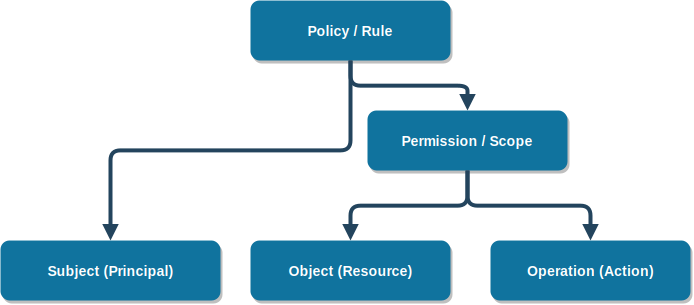

# Access Specification

<!--prettier-ignore-->
!!! tip "Access Designing"
    There are many main concepts in **Access Designing**:

    -   **Subject (Principal)**: User, Group, Role, ...
    -   **Object (Resource)**: Files, Tables, Printers, ...
    -   **Operation (Action)**: Create, Read, Update, Delete, ...
    -   **Permission (Scope)**: An specific `operation` on specific `object`
    -   **Policy (Rule)**: An specific `permission` assigned to specific `subject`
    -   **Reference Monitor (Enforcer)**: Access Server, grants or denies access requests

    ---

    

    The logic of this **Operations** can implement in application

---

## Access Control Matrices

<!--prettier-ignore-->
!!! tip "Access Control Matrices"
    Is a way to **Visualize** all policies:

    -   **Access Control Matrix (ACM)**: A matirix show `who(subject)` can act `what(operation)` on `which(object)`
    -   **Capability Table (CT)**: All `operation` of a `subject` per each `object` (**rows of ACM**)
    -   **Access Control List (ACL)**: All `operation` of an `object` per each `subject` (**columns of ACM**)

| **`Files`** | File1   | File2              | File3   | Folder1 | Folder2            | Folder 3 |
| ----------- | ------- | ------------------ | ------- | ------- | ------------------ | -------- |
| **User1**   | ReadAll | ReadAll            | ReadAll | ReadAll | ReadAll, CreateAll | ReadAll  |
| **User2**   | ReadAll | ReadAll            | ReadAll | ReadAll | ReadAll, CreateAll | ReadAll  |
| **User3**   | -       | ReadAll, CreateAll | ReadAll | ReadAll | ReadAll, CreateAll | ReadAll  |
| **Role1**   | -       | ReadMine           | -       | -       | ReadAll            | -        |
| **Role2**   | -       | ReadMine           | -       | -       | ReadAll            | -        |
| **Role3**   | -       | ReadMine           | -       | -       | ReadAll            | -        |

---

## Access Permissions

<!--prettier-ignore-->
!!! tip "Access Permissions"
    There are three main types of **Permissions**:

    1. **Full CRUD**: `CreateAll`, `ReadAll`, `UpdateAll`, `DeleteAll`
    2. **Filter CRUD**: `CreateMine`, `ReadTheir`, `UpdateNonZero`, ...
    3. **Field CRUD**: `CreateName`, `ReadProfile`, `UpdateAge`, ...

-   **File1-ReadAll**: Read all files 1
-   **File2-CreateAll**: Create all files 2
-   **File2-ReadMine**: Read all files 2 with `userId=$USER_ID`

---

## Preset Rules

<!--prettier-ignore-->
!!! tip "Preset Rules"
    These rules will **Force rewrite** some fields of entities in **Create** or **Update** methods, for example users cannot set **CreateDate**, in creation, instead this field will filled automatically

1. **File1-CreateAll**:
    - **FileID**: uuid4()
    - **FileDate**: now()
2. **File1-UpdateAll**:
    1. **FileID**: null
    2. **FileDate**: now()
