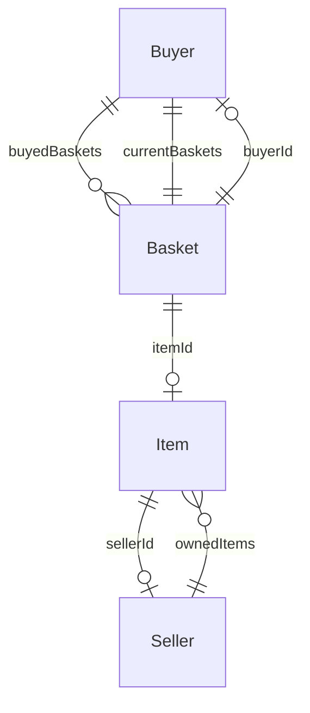
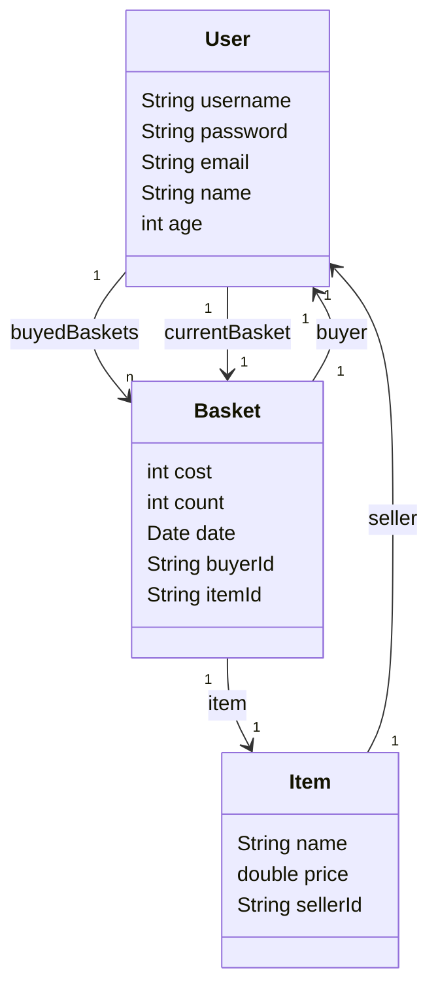

# Model Diagram

<!--prettier-ignore-->
!!! tip "Model Designing"
    For designing **Models** we must do these steps:

    1. Design the **Model** for business
    2. Define models **Properties**
    3. Define models **Key Relations** (**belongsTo**)
    4. Define models **Business Relations** (**hasOne**, **hasMany**)
    5. Integrate business models into **Abstract Model**
    6. Define **System Roles** based on **User Business Models**

---

## Domain Models (ER Diagram)

<!--prettier-ignore-->
!!! tip "Domain Model Designing"
    For designing the **Domain Models** we must follow these steps:

    1. Find business **Entities**
    2. Find entities **Key Relations** (**belongsTo**)
    3. Find entities **Business Relations** (**hasOne**, **hasMany**)

---

## Data Models (Class Diagram)

<!--prettier-ignore-->
!!! tip "Data Model Designing"
    For designing the **Data Models** we must follow these steps:

    1. Integrate **Business Entities** into **Abstract Data Models**
    2. Find model **Properties**

---

## Domain into Data

---

## System Roles

1. **Admin**
2. **Buyer**
3. **Seller**
